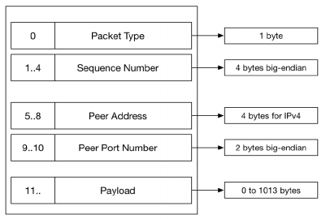
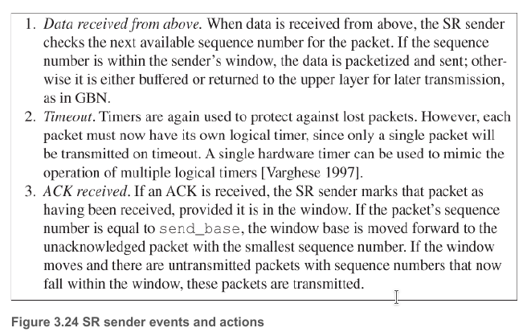
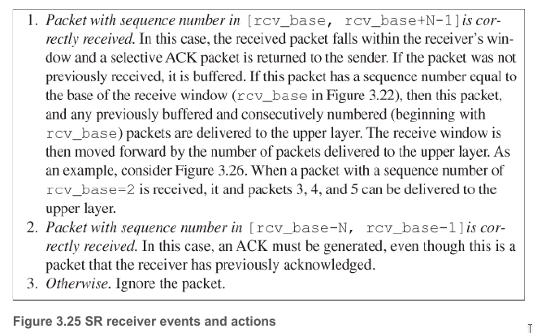
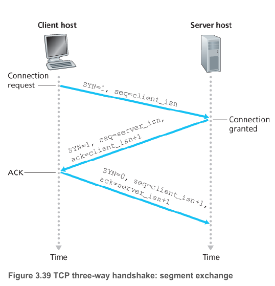

# Lab Assignment 3

## Goal
Use unreliable UDP to implement a reliable transport protocol.
More specifically, implement Selective-Repeat ARQ technique with UDP in both the file server and client that you have previously created.

## Grading Policy
- Reliable environment:
    - Mimick 3-way handshake from TCP.
    - HTTP GET --> read content of a file and listing directory.
    - HTTP POST --> create a new file on the file server.
- Resilient to dropped packets (alone)
- Resilient to delayed packets (alone)
- Resilient to simultaneous dropping and delaying of packets.

## Given Files
The are a few files given to start the assignment.

The file that allows for the dropping and delaying of packets is  `router`.
It acts as the intermediary between the client and the server.
It's function is only to mimic an unreliable network.
To run the router, look in the folder that's associated with your OS and make sure the file is marked as executable for your user.

The files that are there as starting points are:
 * [`Packet.java`](./src/Packet.java)
 * [`UDPServer.java`](./src/UDPServer.java)
 * [`UDPClient.java`](./src/UDPClient.java)

---

## Additional Information

### Packet
The `Packet` class encapsulates a lot of the information that needs to be given for reliable transmission.
Here is a visualization of the bytes in the packet:

Take into account that a single packet has a maximum size for the payload section, which is of 1024 bytes.
That implies that if the server needs to send back the content of a file, it might need to split it up between multiple packets.

### Selective Repeat ARQ
Have a window size (# packets that can be in flight) of packets and keep track of the status of each them.
Only resent the packets that have not been acknowledged.
The receiver acknowledges packets.
If out of order packets, the receiver will still buffer them.

### TCP Handshake
The TCP handshake, also known as the 3 way handshake, allows for the establishment of a TP connection between two hosts.

1. Client sends a SYN packet with a random sequence number, r_c.
2. Server responds with a SYN packet with acknowledgement field set to r_c + 1 and a sequence number that it determines, r_s.
3. Client receives the server's packet and can now send data in its payload section with a sequence number r_s + 1.

